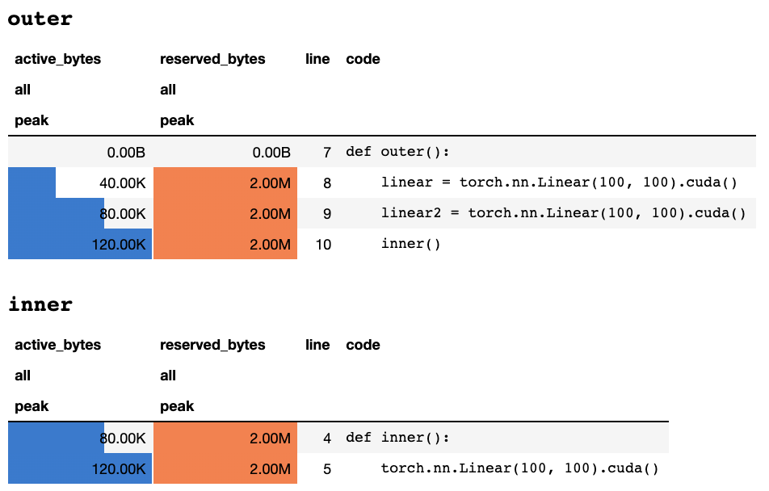

pytorch_memlab
======
[](https://github.com/Stonesjtu/pytorch_memlab/actions/workflows/test.yml)
[](https://github.com/Stonesjtu/pytorch_memlab/actions/workflows/pypi-publish.yml)

[](https://github.com/Stonesjtu/pytorch_memlab/actions/workflows/github-code-scanning/codeql)


A simple and accurate **CUDA** memory management laboratory for pytorch,
it consists of different parts about the memory:

- Features:

  - Memory Profiler: A `line_profiler` style CUDA memory profiler with simple API.
  - Memory Reporter: A reporter to inspect tensors occupying the CUDA memory.
  - Courtesy: An interesting feature to temporarily move all the CUDA tensors into
    CPU memory for courtesy, and of course the backward transferring.
  - IPython support through `%mlrun`/`%%mlrun` line/cell magic
    commands.


- Table of Contents
  * [Installation](#installation)
  * [User-Doc](#user-doc)
    + [Memory Profiler](#memory-profiler)
    + [IPython support](#ipython-support)
    + [Memory Reporter](#memory-reporter)
    + [Courtesy](#courtesy)
    + [ACK](#ack)
  * [CHANGES](#changes)

Installation
-----

- Released version:
```bash
pip install pytorch_memlab
```

- Newest version:
```bash
pip install git+https://github.com/stonesjtu/pytorch_memlab
```

What's for
-----

Out-Of-Memory errors in pytorch happen frequently, for new-bees and
experienced programmers. A common reason is that most people don't really
learn the underlying memory management philosophy of pytorch and GPUs.
They wrote memory in-efficient codes and complained about pytorch eating too
much CUDA memory.

In this repo, I'm going to share some useful tools to help debugging OOM, or
to inspect the underlying mechanism if anyone is interested in.


User-Doc
-----

### Memory Profiler

The memory profiler is a modification of python's `line_profiler`, it gives
the memory usage info for each line of code in the specified function/method.

#### Sample:

```python
import torch
from pytorch_memlab import LineProfiler

def inner():
    torch.nn.Linear(100, 100).cuda()

def outer():
    linear = torch.nn.Linear(100, 100).cuda()
    linear2 = torch.nn.Linear(100, 100).cuda()
    linear3 = torch.nn.Linear(100, 100).cuda()

work()
```

After the script finishes or interrupted by keyboard, it gives the following
profiling info if you're in a Jupyter notebook:

<p align="center"></p>

or the following info if you're in a text-only terminal:

```
## outer

active_bytes reserved_bytes line  code
         all            all
        peak           peak
       0.00B          0.00B    7  def outer():
      40.00K          2.00M    8      linear = torch.nn.Linear(100, 100).cuda()
      80.00K          2.00M    9      linear2 = torch.nn.Linear(100, 100).cuda()
     120.00K          2.00M   10      inner()


## inner

active_bytes reserved_bytes line  code
         all            all
        peak           peak
      80.00K          2.00M    4  def inner():
     120.00K          2.00M    5      torch.nn.Linear(100, 100).cuda()
```

An explanation of what each column means can be found in the [Torch documentation](https://pytorch.org/docs/stable/cuda.html#torch.cuda.memory_stats). The name of any field from `memory_stats()`
can be passed to `display()` to view the corresponding statistic.

If you use `profile` decorator, the memory statistics are collected during
multiple runs and only the maximum one is displayed at the end.
We also provide a more flexible API called `profile_every` which prints the
memory info every *N* times of function execution. You can simply replace
`@profile` with `@profile_every(1)` to print the memory usage for each
execution.

The `@profile` and `@profile_every` can also be mixed to gain more control
of the debugging granularity.

- You can also add the decorator in the module class:

```python
class Net(torch.nn.Module):
    def __init__(self):
        super().__init__()
    @profile
    def forward(self, inp):
        #do_something
```

- The *Line Profiler* profiles the memory usage of CUDA device 0 by default,
you may want to switch the device to profile by `set_target_gpu`. The gpu
selection is globally,  which means you have to remember which gpu you are
profiling on during the whole process:

```python
import torch
from pytorch_memlab import profile, set_target_gpu
@profile
def func():
    net1 = torch.nn.Linear(1024, 1024).cuda(0)
    set_target_gpu(1)
    net2 = torch.nn.Linear(1024, 1024).cuda(1)
    set_target_gpu(0)
    net3 = torch.nn.Linear(1024, 1024).cuda(0)

func()
```


More samples can be found in `test/test_line_profiler.py`

### IPython support

Make sure you have `IPython` installed, or have installed `pytorch-memlab` with
`pip install pytorch-memlab[ipython]`.

First, load the extension:

```python
%load_ext pytorch_memlab
```

This makes the `%mlrun` and `%%mlrun` line/cell magics available for use. For
example, in a new cell run the following to profile an entire cell

```python
%%mlrun -f func
import torch
from pytorch_memlab import profile, set_target_gpu
def func():
    net1 = torch.nn.Linear(1024, 1024).cuda(0)
    set_target_gpu(1)
    net2 = torch.nn.Linear(1024, 1024).cuda(1)
    set_target_gpu(0)
    net3 = torch.nn.Linear(1024, 1024).cuda(0)
```

Or you can invoke the profiler for a single statement on via the `%mlrun` cell
magic.

```python
import torch
from pytorch_memlab import profile, set_target_gpu
def func(input_size):
    net1 = torch.nn.Linear(input_size, 1024).cuda(0)
%mlrun -f func func(2048)
```

See `%mlrun?` for help on what arguments are supported. You can set the GPU
device to profile, dump profiling results to a file, and return the
`LineProfiler` object for post-profile inspection.

Find out more by checking out the [demo Jupyter notebook](./demo.ipynb)


### Memory Reporter

As *Memory Profiler* only gives the overall memory usage information by lines,
a more low-level memory usage information can be obtained by *Memory Reporter*.

*Memory reporter* iterates all the `Tensor` objects and gets the underlying
`UntypedStorage` (previously `Storage`) object to get the actual memory usage instead of the surface
`Tensor.size`.

> see [UntypedStorage](https://pytorch.org/docs/stable/storage.html#torch.UntypedStorage) for detailed
>  information

#### Sample

- A minimal one:

```python
import torch
from pytorch_memlab import MemReporter
linear = torch.nn.Linear(1024, 1024).cuda()
reporter = MemReporter()
reporter.report()
```
outputs:
```
Element type                                            Size  Used MEM
-------------------------------------------------------------------------------
Storage on cuda:0
Parameter0                                      (1024, 1024)     4.00M
Parameter1                                           (1024,)     4.00K
-------------------------------------------------------------------------------
Total Tensors: 1049600  Used Memory: 4.00M
The allocated memory on cuda:0: 4.00M
-------------------------------------------------------------------------------
```

- You can also pass in a model object for automatically name inference.

```python
import torch
from pytorch_memlab import MemReporter

linear = torch.nn.Linear(1024, 1024).cuda()
inp = torch.Tensor(512, 1024).cuda()
# pass in a model to automatically infer the tensor names
reporter = MemReporter(linear)
out = linear(inp).mean()
print('========= before backward =========')
reporter.report()
out.backward()
print('========= after backward =========')
reporter.report()
```

outputs:
```
========= before backward =========
Element type                                            Size  Used MEM
-------------------------------------------------------------------------------
Storage on cuda:0
weight                                          (1024, 1024)     4.00M
bias                                                 (1024,)     4.00K
Tensor0                                          (512, 1024)     2.00M
Tensor1                                                 (1,)   512.00B
-------------------------------------------------------------------------------
Total Tensors: 1573889  Used Memory: 6.00M
The allocated memory on cuda:0: 6.00M
-------------------------------------------------------------------------------
========= after backward =========
Element type                                            Size  Used MEM
-------------------------------------------------------------------------------
Storage on cuda:0
weight                                          (1024, 1024)     4.00M
weight.grad                                     (1024, 1024)     4.00M
bias                                                 (1024,)     4.00K
bias.grad                                            (1024,)     4.00K
Tensor0                                          (512, 1024)     2.00M
Tensor1                                                 (1,)   512.00B
-------------------------------------------------------------------------------
Total Tensors: 2623489  Used Memory: 10.01M
The allocated memory on cuda:0: 10.01M
-------------------------------------------------------------------------------
```


- The reporter automatically deals with the sharing weights parameters:

```python
import torch
from pytorch_memlab import MemReporter

linear = torch.nn.Linear(1024, 1024).cuda()
linear2 = torch.nn.Linear(1024, 1024).cuda()
linear2.weight = linear.weight
container = torch.nn.Sequential(
    linear, linear2
)
inp = torch.Tensor(512, 1024).cuda()
# pass in a model to automatically infer the tensor names

out = container(inp).mean()
out.backward()

# verbose shows how storage is shared across multiple Tensors
reporter = MemReporter(container)
reporter.report(verbose=True)
```

outputs:
```
Element type                                            Size  Used MEM
-------------------------------------------------------------------------------
Storage on cuda:0
0.weight                                        (1024, 1024)     4.00M
0.weight.grad                                   (1024, 1024)     4.00M
0.bias                                               (1024,)     4.00K
0.bias.grad                                          (1024,)     4.00K
1.bias                                               (1024,)     4.00K
1.bias.grad                                          (1024,)     4.00K
Tensor0                                          (512, 1024)     2.00M
Tensor1                                                 (1,)   512.00B
-------------------------------------------------------------------------------
Total Tensors: 2625537  Used Memory: 10.02M
The allocated memory on cuda:0: 10.02M
-------------------------------------------------------------------------------
```

- You can better understand the memory layout for more complicated module:

```python
import torch
from pytorch_memlab import MemReporter

lstm = torch.nn.LSTM(1024, 1024).cuda()
reporter = MemReporter(lstm)
reporter.report(verbose=True)
inp = torch.Tensor(10, 10, 1024).cuda()
out, _ = lstm(inp)
out.mean().backward()
reporter.report(verbose=True)
```

As shown below, the `(->)` indicates the re-use of the same storage back-end
outputs:
```
Element type                                            Size  Used MEM
-------------------------------------------------------------------------------
Storage on cuda:0
weight_ih_l0                                    (4096, 1024)    32.03M
weight_hh_l0(->weight_ih_l0)                    (4096, 1024)     0.00B
bias_ih_l0(->weight_ih_l0)                           (4096,)     0.00B
bias_hh_l0(->weight_ih_l0)                           (4096,)     0.00B
Tensor0                                       (10, 10, 1024)   400.00K
-------------------------------------------------------------------------------
Total Tensors: 8499200  Used Memory: 32.42M
The allocated memory on cuda:0: 32.52M
Memory differs due to the matrix alignment
-------------------------------------------------------------------------------
Element type                                            Size  Used MEM
-------------------------------------------------------------------------------
Storage on cuda:0
weight_ih_l0                                    (4096, 1024)    32.03M
weight_ih_l0.grad                               (4096, 1024)    32.03M
weight_hh_l0(->weight_ih_l0)                    (4096, 1024)     0.00B
weight_hh_l0.grad(->weight_ih_l0.grad)          (4096, 1024)     0.00B
bias_ih_l0(->weight_ih_l0)                           (4096,)     0.00B
bias_ih_l0.grad(->weight_ih_l0.grad)                 (4096,)     0.00B
bias_hh_l0(->weight_ih_l0)                           (4096,)     0.00B
bias_hh_l0.grad(->weight_ih_l0.grad)                 (4096,)     0.00B
Tensor0                                       (10, 10, 1024)   400.00K
Tensor1                                       (10, 10, 1024)   400.00K
Tensor2                                        (1, 10, 1024)    40.00K
Tensor3                                        (1, 10, 1024)    40.00K
-------------------------------------------------------------------------------
Total Tensors: 17018880         Used Memory: 64.92M
The allocated memory on cuda:0: 65.11M
Memory differs due to the matrix alignment
-------------------------------------------------------------------------------
```

NOTICE:
> When forwarding with `grad_mode=True`, pytorch maintains tensor buffers for
> future Back-Propagation, in C level. So these buffers are not going to be
> managed or collected by pytorch. But if you store these intermediate results
> as python variables, then they will be reported.

- You can also filter the device to report on by passing extra arguments:
`report(device=torch.device(0))`

- A failed example due to pytorch's C side tensor buffers

In the following example, a temp buffer is created at `inp * (inp + 2)` to
store both `inp` and `inp + 2`, unfortunately python only knows the existence
of inp, so we have *2M* memory lost, which is the same size of Tensor `inp`.

```python
import torch
from pytorch_memlab import MemReporter

linear = torch.nn.Linear(1024, 1024).cuda()
inp = torch.Tensor(512, 1024).cuda()
# pass in a model to automatically infer the tensor names
reporter = MemReporter(linear)
out = linear(inp * (inp + 2)).mean()
reporter.report()
```

outputs:
```
Element type                                            Size  Used MEM
-------------------------------------------------------------------------------
Storage on cuda:0
weight                                          (1024, 1024)     4.00M
bias                                                 (1024,)     4.00K
Tensor0                                          (512, 1024)     2.00M
Tensor1                                                 (1,)   512.00B
-------------------------------------------------------------------------------
Total Tensors: 1573889  Used Memory: 6.00M
The allocated memory on cuda:0: 8.00M
Memory differs due to the matrix alignment or invisible gradient buffer tensors
-------------------------------------------------------------------------------
```


### Courtesy

Sometimes people would like to preempt your running task, but you don't want
to save checkpoint and then load, actually all they need is GPU resources (
typically CPU resources and CPU memory is always spare in GPU clusters), so
you can move all your workspaces from GPU to CPU and then halt your task until
a restart signal is triggered, instead of saving&loading checkpoints and
bootstrapping from scratch.

Still developing..... But you can have fun with:
```python
from pytorch_memlab import Courtesy

iamcourtesy = Courtesy()
for i in range(num_iteration):
    if something_happens:
        iamcourtesy.yield_memory()
        wait_for_restart_signal()
        iamcourtesy.restore()
```

#### Known Issues

- As is stated above in `Memory_Reporter`, intermediate tensors are not covered
properly, so you may want to insert such courtesy logics after `backward` or
before `forward`.
- Currently the CUDA context of pytorch requires about 1 GB CUDA memory, which
means even all Tensors are on CPU, 1GB of CUDA memory is wasted, :-(. However
it's still under investigation if I can fully destroy the context and then
re-init.


### ACK

I suffered a lot debugging weird memory usage during my 3-years of developing
efficient Deep Learning models, and of course learned a lot from the great
open source community.

## CHANGES


##### 0.3.0 (2023-7-29)
  - Fix `DataFrame.drop` for pandas 1.5+
##### 0.2.4 (2021-10-28)
  - Fix colab error (#35)
  - Support python3.8 (#38)
  - Support sparse tensor (#30)
##### 0.2.3 (2020-12-01)
  - Fix name mapping in `MemReporter` (#24)
  - Fix reporter without model input (#22 #25)
##### 0.2.2 (2020-10-23)
  - Fix memory leak in `MemReporter`
##### 0.2.1 (2020-06-18)
  - Fix `line_profiler` not found
##### 0.2.0 (2020-06-15)
  - Add jupyter notebook figure and ipython support
##### 0.1.0 (2020-04-17)
  - Add ipython magic support (#8)
##### 0.0.4 (2019-10-08)
  - Add gpu switch for line-profiler(#2)
  - Add device filter for reporter
##### 0.0.3 (2019-06-15)
  - Install dependency for pip installation
##### 0.0.2 (2019-06-04)
  - Fix statistics shift in loop
##### 0.0.1 (2019-05-28)
  - initial release

## Star History

[](https://star-history.com/#stonesjtu/pytorch_memlab&Date)
